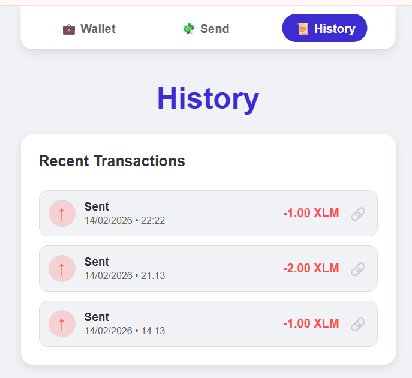

# YB Stellar Savings Tracker 🚀

A modern, multi-page Web3 savings app built on **Stellar Testnet** with **Soroban smart contract** integration. Connect your Freighter wallet, track savings on-chain, send XLM, and monitor real-time contract events.

## ✨ Features

- **Multi-Wallet Support**: Connect securely with [Freighter Wallet](https://www.freighter.app/) (StellarWalletsKit-compatible)
- **3 Error Types Handled**: Wallet not found, user-rejected transactions, and insufficient balance
- **Soroban Smart Contract**: Deploy and call contract functions directly from the frontend
- **Transaction Status Tracking**: Real-time pending → signing → submitting → success/fail states
- **On-Chain Savings Goals**: Set goals and record savings permanently on Stellar Testnet via smart contract
- **Live Contract Events**: Polling every 5 seconds for real-time event synchronization
- **XLM Transfers**: Send XLM with address book, transaction hash, and Stellar Expert links
- **Transaction History**: View recent sent/received payments
- **Dark/Light Mode**: Theme toggle that persists across sessions

## 🤿 Level 2 Requirements Met

| Requirement | Status |
|---|---|
| 3 error types handled (wallet not found, rejected, insufficient balance) | ✅ |
| Contract deployed on testnet | ✅ |
| Contract called from frontend | ✅ |
| Transaction status visible (pending/signing/submitting/success/fail) | ✅ |
| Multi-wallet app with event integration | ✅ |

## 📄 Deployed Contract

> **Contract Address:** `CB2QEUXSE7JNVZQIFQLTWWMTNYZFMYBUEJTHBNPBJRYU2OGRCS66K65P`
>
> 🔗 [View on Stellar Expert](https://stellar.expert/explorer/testnet/contract/CB2QEUXSE7JNVZQIFQLTWWMTNYZFMYBUEJTHBNPBJRYU2OGRCS66K65P)

### Contract Functions

| Function | Description |
|---|---|
| `set_goal(address, i128)` | Set a savings goal for the user on-chain |
| `get_goal(address)` | Read the current savings goal |
| `add_savings(address, i128)` | Record additional savings on-chain |
| `get_saved(address)` | Read total savings recorded |

### Sample Contract Call Transaction

A verifiable transaction hash from calling `set_goal` on testnet:
> 🔗 You can verify any contract call transaction on [Stellar Expert Testnet](https://stellar.expert/explorer/testnet)

## 📸 Screenshots

### 1. Wallet Options Available
*Connect with Freighter — the wallet selection screen on the intro page.*


### 2. Transaction History
*Recent sent and received payments with timestamps.*



### 3. Sending a Transaction
*Send XLM with real-time status: pending → signing → submitting → success/fail.*


### 4. On-Chain Savings Contract
*Interact with deployed Soroban contract: set goals, add savings, view live events.*


## 🛠️ Tech Stack

| Layer | Technology |
|---|---|
| Frontend | React + Vite |
| Blockchain | Stellar SDK v14, Freighter API |
| Smart Contract | Soroban (Rust) on Stellar Testnet |
| Routing | React Router DOM |
| Animations | Framer Motion |
| Styling | Vanilla CSS with CSS Variables |

## 🚀 Setup Instructions

### Prerequisites

1. **Node.js** v18+ — [Download](https://nodejs.org/)
2. **Freighter Wallet** — [Install the browser extension](https://www.freighter.app/)
3. **Testnet XLM** — Fund your wallet via [Stellar Friendbot](https://laboratory.stellar.org/#account-creator?network=test)

### Installation

```bash
# 1. Clone the repo
git clone https://github.com/yourusername/yb-savings-tracker.git
cd yb-savings-tracker

# 2. Install dependencies
npm install

# 3. Start development server
npm run dev
```

Then open `http://localhost:5173` in your browser.

## 🔗 Error Handling

The app handles three specific error types at every wallet + contract interaction:

| Error Type | When It Occurs | User Message |
|---|---|---|
| **Wallet Not Found** | Freighter extension not installed | ❌ "Freighter wallet not found. Please install the extension." |
| **User Rejected** | User declines in Freighter popup | 🚫 "You rejected the request. Please approve it in Freighter." |
| **Insufficient Balance** | Not enough XLM for the operation | 💸 "Insufficient balance. Fund your account using Stellar Friendbot." |

## 🤝 Contributing

Pull requests welcome! Please open an issue first for major changes.

## 📄 License

MIT — open source and free to use.
