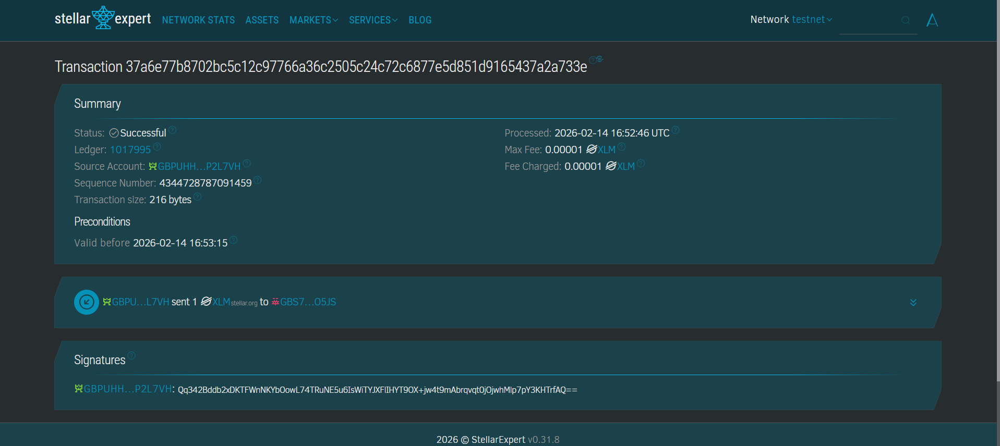

# Stellar Savings Tracker 🚀

A modern, mobile-responsive web application for tracking savings and managing transactions on the Stellar Testnet. This app allows users to connect their Freighter wallet, set savings goals, view transaction history, and easily send XLM to saved contacts.

## ✨ Features

*   **Wallet Integration**: Securely connect with [Freighter Wallet](https://www.freighter.app/).
*   **Savings Goals**: Set a personal XLM savings goal and track your progress visually.
*   **Transaction History**: View your recent payments (Sent/Received) in a clean, animated list.
*   **Address Book**: Save frequently used addresses for quick and easy transactions.
*   **Multi-Page Experience**: Smooth slide transitions between Wallet, Send, and History pages.
*   **Mobile Responsive**: Optimized layout for both desktop and mobile devices.
*   **Dark/Light Mode**: Toggle between themes to suit your preference.

## 🛠️ Technology Stack

*   **Frontend**: React (Vite)
*   **Blockchain**: Stellar SDK, Freighter API
*   **Routing**: React Router DOM
*   **Animations**: Framer Motion
*   **Styling**: Vanilla CSS (Variables & Responsive Design)

## 🚀 Setup Instructions

### Prerequisites

1.  **Node.js**: Ensure you have Node.js installed (v18+ recommended).
2.  **Freighter Wallet**: Install the [Freighter browser extension](https://www.freighter.app/) and create a wallet.
3.  **Testnet XLM**: Fund your wallet using the [Stellar Friendbot](https://laboratory.stellar.org/#account-creator?network=test).

### Installation

1.  Clone the repository:
    ```bash
    git clone https://github.com/yourusername/stellar-savings-tracker.git
    cd stellar-savings-tracker
    ```

2.  Install dependencies:
    ```bash
    npm install
    ```

3.  Start the development server:
    ```bash
    npm run dev
    ```

4.  Open your browser and navigate to the URL shown in the terminal (usually `http://localhost:5173`).

## 📸 Screenshots


### 1. Wallet Connected & Balance
*The main dashboard showing your XLM balance and savings progress.*


### 2. Transaction History
*A list of your recent sent and received transactions.*


### 3. Sending a Transaction
*Sending XLM with the option to save the address to your address book.*


### 4. Successful Transaction
*Confirmation and transaction hash link.*



## 🤝 Contributing

Contributions are welcome! Please feel free to submit a Pull Request.

## 📄 License

This project is open source and available under the [MIT License](LICENSE).
