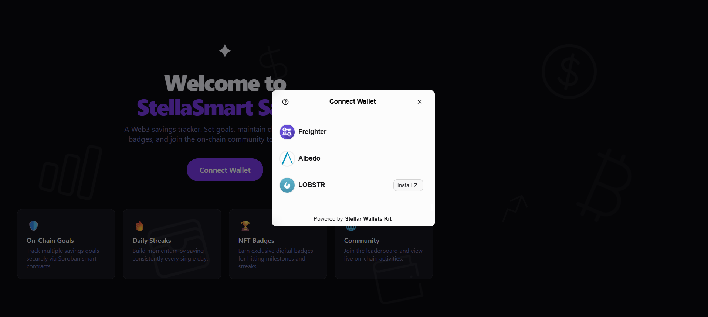
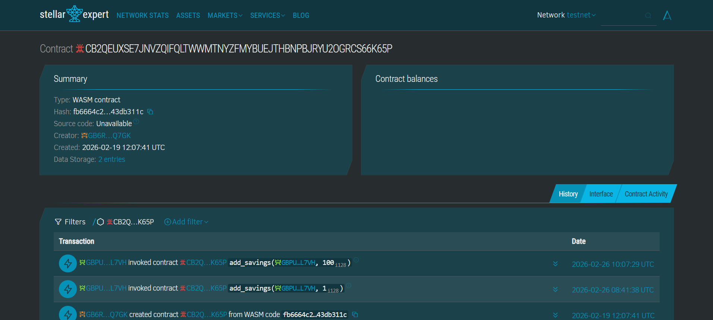
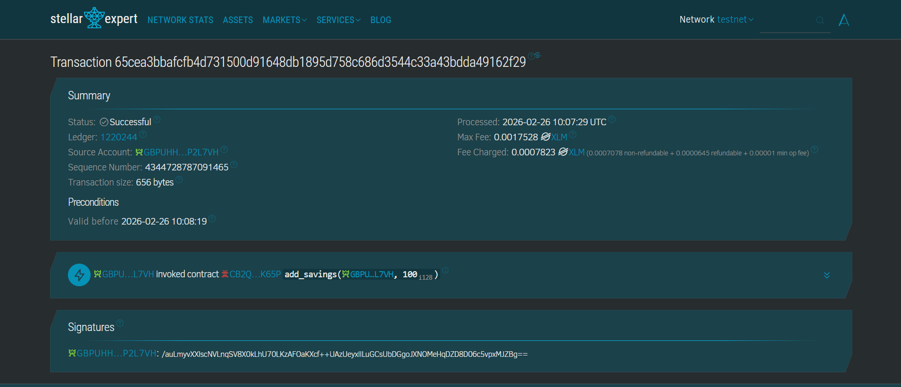

# StellaSmart Saver 🚀

A modern, multi-page Web3 savings tracker built on **Stellar Testnet** with **Soroban smart contract** integration. Connect your favorite wallet, set goals, maintain daily savings streaks, earn NFT-style badges, and interact with the broader savings community on-chain.

### 🔗 Live Demo
> [Live Demo on Vercel](https://yellowbelt.vercel.app/)


### Platform Features
- **Multi-Wallet Support**: Integrated with `@creit-tech/stellar-wallets-kit` supporting Freighter, LOBSTR, xBull, Albedo, and more.
- **Smart Contract Interop**: Deploy and call `set_goal`, `get_goal`, `add_savings`, and `get_saved` functions directly from the React frontend.
- **Robust Error Handling**: Gracefully handles (1) Wallet not found/not supported, (2) User-rejected signatures, and (3) Insufficient XLM balances.
- **Gamified Savings**: Tracks daily savings streaks, awards SVG NFT badges (stored locally), and fires confetti upon goal completions.
- **Community Leaderboard**: Reads on-chain contract data to build a decentralized leaderboard ranking network savers.
- **Live Transaction History**: Fetches XLM payments and Soroban contract invocations (`invoke_host_function`).

---

## 📸 Screenshots

### 1. Wallet Options Available (Multi-Wallet Connect)
*Integrated with StellarWalletsKit offering Freighter, LOBSTR, xBull, and more.*



### 2. On-Chain Savings Goals
*Track your targeted savings. Every contribution is logged on the Soroban smart contract.*


### 3. Community Leaderboard
*Compare your on-chain savings with the rest of the network without needing a traditional backend.*


## 4. Deployed Contract Details

> **Contract Address (Testnet):**
> 
> 
> 🔗 [View Contract on Stellar Expert](https://stellar.expert/explorer/testnet/contract/CB2QEUXSE7JNVZQIFQLTWWMTNYZFMYBUEJTHBNPBJRYU2OGRCS66K65P)

### Sample Contract Call Transaction

A verifiable transaction hash from calling `add_savings` on the testnet:
> 
>
> 🔗 [Verify Transaction on Stellar Expert](https://stellar.expert/explorer/testnet/tx/21b5e5264b301cd23b1bfd83dedba7dbbebc49c6fcb99f2e3be75ab78bba33cc)

---

## 🛠️ Tech Stack

| Layer | Technology |
|---|---|
| **Frontend Framework** | React v18 + Vite |
| **Wallet Integration** | `@creit-tech/stellar-wallets-kit` v3 (JSR) |
| **Blockchain interaction** | `@stellar/stellar-sdk` v14 |
| **Smart Contract** | Soroban (Rust) deployed on Stellar Testnet |
| **Routing** | React Router DOM |
| **Styling** | Vanilla CSS, Glassmorphism UI, Custom CSS Variables |
| **Animations** | `canvas-confetti` |

---

## 🚀 Setup Instructions

### Prerequisites

1. **Node.js** v18+ — [Download Node.js](https://nodejs.org/)
2. **A Stellar Wallet** — Install the [Freighter browser extension](https://www.freighter.app/) or use any supported Stellar wallet.
3. **Testnet XLM** — Fund your account using the [Stellar Friendbot](https://laboratory.stellar.org/#account-creator?network=test).

### Installation

1. **Clone the repository**
   ```bash
   git clone https://github.com/yourusername/stellasmart-saver.git
   cd stellasmart-saver
   ```

2. **Install dependencies**
   ```bash
   # We use --legacy-peer-deps to handle JSR alias resolution cleanly
   npm install --legacy-peer-deps
   ```

3. **Start the development server**
   ```bash
   npm run dev
   ```

4. **Open in browser** 
   Navigate to `http://localhost:5173` (or the port specified by Vite in your terminal).

---

## 🤝 Contributing
Pull requests are welcome! For major changes, please open an issue first to discuss what you would like to change.

## 📄 License
MIT — Open source and free to use.
