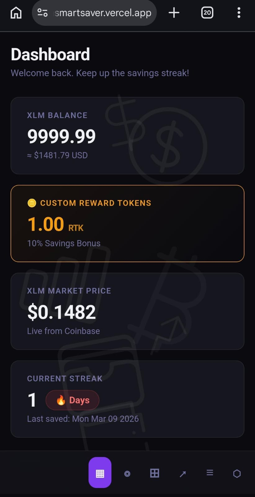
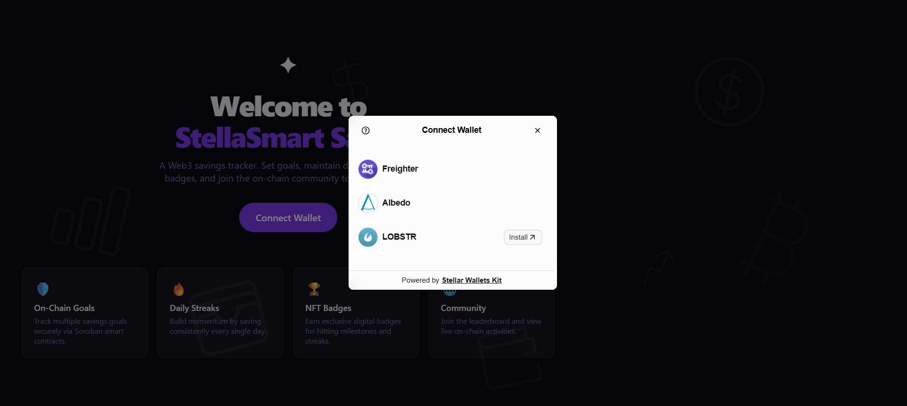
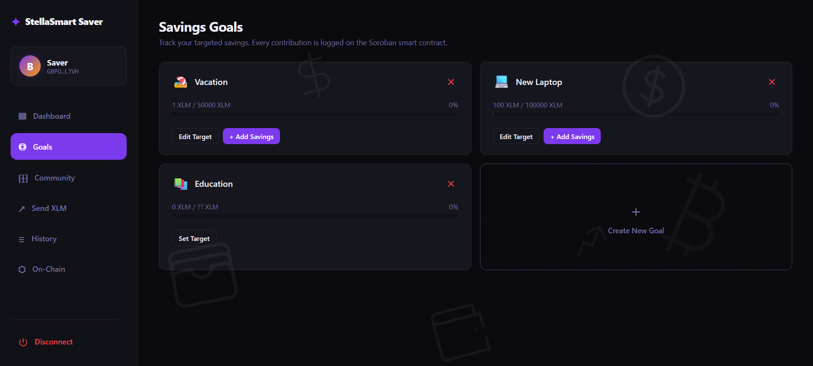
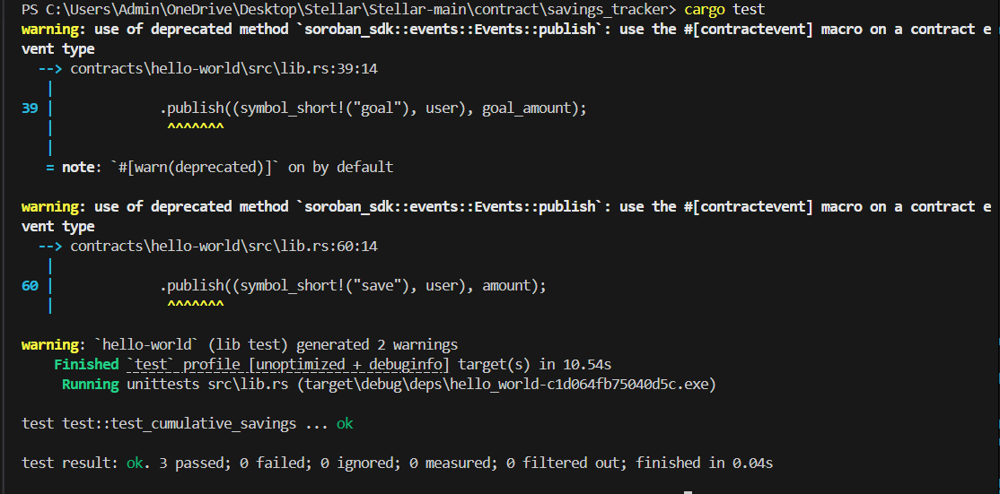

# StellaSmart Saver 

[](https://github.com/purvai12/Stellar/actions/workflows/ci.yml)
A modern, multi-page Web3 savings tracker built on **Stellar Testnet** with **Soroban smart contract** integration. Connect your favorite wallet, set goals, maintain daily savings streaks, earn NFT-style badges, and interact with the broader savings community on-chain.

##  Requirements Fulfilled:
- **Live Demo:** 
- **CI/CD Pipeline:** 
  Active and running via GitHub Actions (see badge above).  
- **Mobile Responsive View:** 
  Screenshot is provided in this file at the bottom with other screenshots.
- **Savings Tracker Contract:** `CCXJ4ETYDS7YNJCMXEYHL3H54B5SGEPUZGAOKRHVBF7ND7H3V55QP2YL`
- **Custom Reward Token (Pool/Asset):** `CBV6MABYTVUDMXIOSNPXT4GQ4NSJLUDZISGWRXTZXYLQYDNAWYCJY5HG` 
- **Contract Deployment & Link Transaction Hash:** [`6f74455365bfa12eb535fa99cb7047ba95bccb51021ccd073355215...`](https://stellar.expert/explorer/testnet/tx/6f74455365bfa12eb535fa99cb7047ba95bccb51021ccd073355215527bfa008c) (Initializes inter-contract calls)

### Platform Features
- **Multi-Wallet Support**: Integrated with `@creit-tech/stellar-wallets-kit` supporting Freighter, LOBSTR, xBull, Albedo, and more.
- **Smart Contract Interop**: Deploy and call `set_goal`, `get_goal`, `add_savings`, and `get_saved` functions directly from the React frontend.
- **Robust Error Handling**: Gracefully handles (1) Wallet not found/not supported, (2) User-rejected signatures, and (3) Insufficient XLM balances.
- **Gamified Savings**: Tracks daily savings streaks, awards SVG NFT badges (stored locally), and fires confetti upon goal completions.
- **Community Leaderboard**: Reads on-chain contract data to build a decentralized leaderboard ranking network savers.
- **Live Transaction History**: Fetches XLM payments and Soroban contract invocations (`invoke_host_function`).

---
### Demo Video
   

##  Screenshots

### Mobile Responsive View
*The application is fully responsive and optimized for mobile devices.*



### 1. Wallet Options Available (Multi-Wallet Connect)
*Integrated with StellarWalletsKit offering Freighter, LOBSTR, xBull, and more.*



### 2. On-Chain Savings Goals
*Track your targeted savings. Every contribution is logged on the Soroban smart contract.*



### 3. Test Outputs



## Deployed Contract Details

> **Savings Tracker Contract Address (Testnet):** `CCXJ4ETYDS7YNJCMXEYHL3H54B5SGEPUZGAOKRHVBF7ND7H3V55QP2YL`
> **Reward Token Contract Address (Testnet):** `CBV6MABYTVUDMXIOSNPXT4GQ4NSJLUDZISGWRXTZXYLQYDNAWYCJY5HG`
> 
> [View Tracker Contract on Stellar Expert](https://stellar.expert/explorer/testnet/contract/CCXJ4ETYDS7YNJCMXEYHL3H54B5SGEPUZGAOKRHVBF7ND7H3V55QP2YL)

### Sample Inter-Contract Call Transaction

A verifiable transaction hash demonstrating the `add_savings` invocation internally triggering the Token `mint` function on the testnet:
> `8da6244de410d281393c21868cfa2e3cc31c9cd95d997728533cfd45b610cf67`(https://stellar.expert/explorer/testnet/tx/8da6244de410d281393c21868cfa2e3cc31c9cd95d997728533cfd45b610cf67)

---

##  Tech Stack

| Layer | Technology |
|---|---|
| **Frontend Framework** | React v18 + Vite |
| **Wallet Integration** | `@creit-tech/stellar-wallets-kit` v3 (JSR) |
| **Blockchain interaction** | `@stellar/stellar-sdk` v14 |
| **Smart Contract** | Soroban (Rust) deployed on Stellar Testnet |
| **Routing** | React Router DOM |
| **Styling** | Vanilla CSS, Glassmorphism UI, Custom CSS Variables |
| **Animations** | `canvas-confetti` |

---

##  Setup Instructions

### Prerequisites

1. **Node.js** v18+ — [Download Node.js](https://nodejs.org/)
2. **A Stellar Wallet** — Install the [Freighter browser extension](https://www.freighter.app/) or use any supported Stellar wallet.
3. **Testnet XLM** — Fund your account using the [Stellar Friendbot](https://laboratory.stellar.org/#account-creator?network=test).

### Installation

1. **Clone the repository**
   ```bash
   git clone https://github.com/purvai12/Stellar.git
   cd Stellar-main
   ```

2. **Install dependencies**
   ```bash
   # We use --legacy-peer-deps to handle JSR alias resolution cleanly
   npm install --legacy-peer-deps
   ```

3. **Start the development server**
   ```bash
   npm run dev
   ```

4. **Open in browser** 
   Navigate to `http://localhost:5173` (or the port specified by Vite in your terminal).

---

##  Contributing
Pull requests are welcome! For major changes, please open an issue first to discuss what you would like to change.

##  License
MIT — Open source and free to use.
